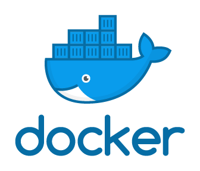

# SpringBoot Docker-Compose

<br/>

<div align="center">



<br/>
<br/>

Docker Compose support in Spring Boot 3.1 builds <br/>on top of the ConnectionDetails abstraction, <br/>which we’ve featured in a
separate blog post.

</div>


<div align="center">

[](https://spring.io/blog/2023/06/21/docker-compose-support-in-spring-boot-3-1)

</div>

<br/><br/><br/><br/><br/>

## 1. Getting Started

프로젝트 실행 전 .env와 .yml 파일을 설정해주세요. 

> Java17 / Kotlin1.7 버전 이상의 JDK를 설치해야 합니다.

<br/><br/><br/>

## Run Application

````text
$ ./gradlew bootRun
````

<br/><br/><br/>

## Run Test

````text
$ ./gradlew test
````

<br/><br/><br/>

## Run Build

````text
$ ./gradlew build
````

<br/><br/><br/><br/><br/><br/>

## 2. 도커 설정

.env 파일 예시. 

```text
MYSQL_ROOT_PASSWORD=ROOT_PASSWORD
MYSQL_DATABASE=DATABASE
MYSQL_USER=USER
MYSQL_PASSWORD=PASSWORD
TZ=Asia/Seoul
```

<br/><br/><br/><br/>

.env 파일의 MYSQL_DATABASE 값은 .yml의 데이터베이스 스키마와 일치해야 합니다.

```yaml
spring:
  
  ......
  
  datasource:
    driver-class-name: com.mysql.cj.jdbc.Driver
    
    # .env 파일의 MYSQL_DATABASE와 일치
    url: jdbc:mysql://localhost:3306/${MYSQL_DATABASE}
    username: USER
    password: PASSWORD
    max-lifetime: 30000
    hikari:
      maximum-pool-size: 500
```
